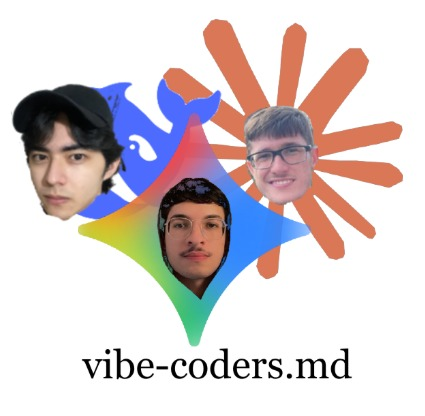
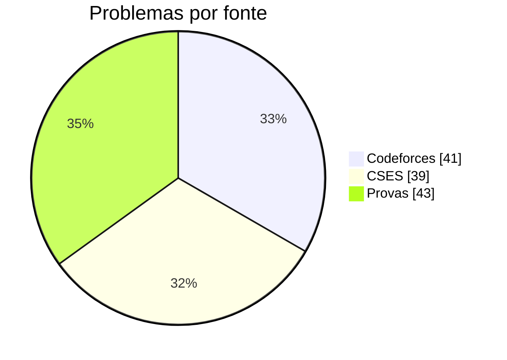
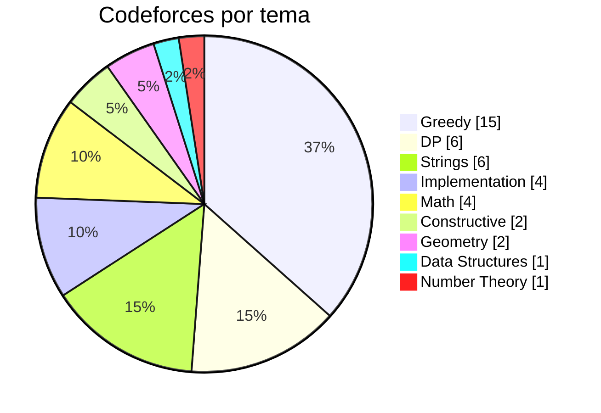
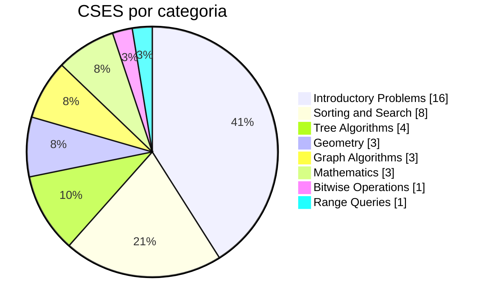

<h1 align="center">🏆 Vibe Coders</h1>

  <em>Programação Competitiva</em> 
  Extensão <strong>PROTIVA</strong> · <strong>UNESP — Bauru</strong>

<!-- Coloque a foto do time em assets/team.jpg (ou troque a extensão abaixo) -->

  

---

## 👥 O Time

Somos o **Vibe Coders**, um time de programação competitiva da extensão
**PROTIVA**, da **UNESP — campus de Bauru**. Treinamos resolvendo problemas no
Codeforces e no CSES e participamos de competições como a Maratona SBC de
Programação (ICPC Brasil), a Paulista e a Mineira.

| Integrante | Curso | GitHub |
|---|---|---|
| Fernando Hiroshi Murusaki | BCC | [@hiroshimurosaki](https://github.com/hiroshimurosaki) |
| Igor dos Reis Gomes | BCC | [@igor-reisg](https://github.com/igor-reisg) |
| Pedro da Costa Sorge | BCC | [@Pedrosorge](https://github.com/Pedrosorge) |

---

## 📊 Estatísticas

> Atualizadas automaticamente a cada push pelo workflow
> [`update-stats`](.github/workflows/update-stats.yml).

<!-- STATS:START -->
> **123** problemas resolvidos · **41** Codeforces · **39** CSES · **43** em provas (1 competições)

### Por fonte

### Codeforces por tema

| Tema | Resolvidos |
|---|---|
| Greedy | 15 |
| DP | 6 |
| Strings | 6 |
| Implementation | 4 |
| Math | 4 |
| Constructive | 2 |
| Geometry | 2 |
| Data Structures | 1 |
| Number Theory | 1 |

### CSES por categoria

### Provas & competições

| Competição | Problemas |
|---|---|
| Maratonas | 43 |
<!-- STATS:END -->

---

## 🗂️ Organização do repositório

- **`Codeforces/`** — problemas do Codeforces, organizados **por tema** (Greedy,
  DP, Strings, Geometry, …). Cada arquivo traz no topo um header com o nome do
  problema, código, rating, link e tags.
- **`CSES/`** — problemas do *CSES Problem Set*, por categoria.
- **Pastas de prova** (`Paulista-2026/`, `ICPC-FP-2024/`, `Mineira-2026/`, …) —
  soluções de competições, mantidas com o nome original do problema.

> As estatísticas e gráficos acima são gerados por
> [`scripts/gen_readme_stats.py`](scripts/gen_readme_stats.py). Para atualizar
> localmente: `python3 scripts/gen_readme_stats.py`.
